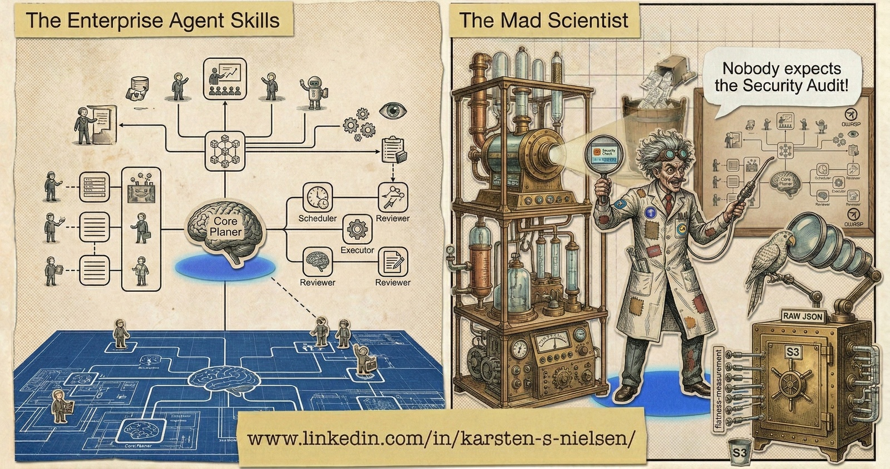

# mad-scientist-skills



A collection of specialized [Claude Code](https://docs.anthropic.com/en/docs/claude-code) skills for software architecture, security auditing, observability auditing, and pre-commit quality gates.

## Skills

| Skill | Description | Invoke |
|-------|-------------|--------|
| **c4** | C4 architecture diagrams using Structurizr DSL — self-contained HTML with embedded SVGs | `/mad-scientist-skills:c4` |
| **final-review** | Pre-commit quality gate — code review, documentation check, and architecture diagram generation | `/mad-scientist-skills:final-review` |
| **observability-audit** | Two-tier observability audit (Standard/Enterprise) — instrumentation, logging, metrics, tracing, pipeline/ML monitoring, alerting, SLIs/SLOs (beta) | `/mad-scientist-skills:observability-audit` |
| **security-audit** | Two-tier security audit (Standard/Enterprise) — STRIDE, OWASP Top 10, infrastructure hardening, supply chain | `/mad-scientist-skills:security-audit` |

## Installation

Add the marketplace (one-time):

```
/plugin marketplace add karsten-s-nielsen/mad-scientist-skills
```

Install the plugin:

```
/plugin install mad-scientist-skills@mad-scientist-skills
```

## Prerequisites

- **Java 21+** — required by the c4 skill for local Structurizr/PlantUML rendering. Both `structurizr.war` and `plantuml.jar` are auto-downloaded on first use.

## Skill Details

<details>
<summary><strong>c4</strong> — C4 Architecture Diagrams</summary>

Generates interactive, self-contained HTML architecture diagrams using the [C4 model](https://c4model.com/) and [Structurizr DSL](https://docs.structurizr.com/dsl).

### Rendering pipeline

Structurizr DSL → structurizr.war export → PlantUML C4 → plantuml.jar → SVG → embedded HTML

### What it produces

A single HTML file with:
- Tabbed navigation between C4 diagram levels
- Embedded SVGs (no CDN or runtime dependencies)
- Copyable Structurizr DSL source panel
- Dark theme — just open in a browser

A companion `.dsl` source file for version control.

### Diagram types

| Level | What it shows |
|-------|---------------|
| **System Context** | People, your system, and external dependencies |
| **Container** | Applications, databases, queues, and their protocols |
| **Component** | Internal structure of a single container |
| **Dynamic** | Numbered interaction flows for specific scenarios |
| **Deployment** | Infrastructure, cloud regions, subnets, and scaling |

### Assembler script

Includes `c4_assemble.py` — cleans rendered SVGs and assembles them into the HTML viewer. Auto-detects views from SVG filenames and verifies each SVG is clean before embedding.

### Usage

Ask naturally ("Create a C4 diagram for this project") or invoke directly:

```
/mad-scientist-skills:c4
```

</details>

<details>
<summary><strong>final-review</strong> — Pre-Commit Quality Gate</summary>

Reviews your entire project before you commit.

### What it does

1. **Code quality review** — consistency, best practices, dead code, type safety, security
2. **Documentation review** — ensures README, CLAUDE.md, and API docs match the actual code
3. **Architecture diagram** — generates or updates `architecture.html` using the c4 skill
4. **Verification summary** — structured report with issues found, fixes applied, and commit readiness

### Usage

Ask naturally ("Final review", "Check everything before commit") or invoke directly:

```
/mad-scientist-skills:final-review
```

</details>

<details>
<summary><strong>observability-audit</strong> — Two-Tier Observability Audit (beta)</summary>

Two-mode, two-tier observability analysis: **planning** (before code) and **audit** (existing code/infra). Each phase has **Standard** (free/open-source tools) and **Enterprise** (paid observability platforms) tiers.

### Coverage

| Phase | Area | Planning | Audit |
|-------|------|:--------:|:-----:|
| 0 | Anti-pattern scanning (print debugging, swallowed errors) | | x |
| 1 | Observability surface mapping | x | x |
| 2 | Instrumentation foundation (OpenTelemetry) | x | x |
| 3 | Structured logging | | x |
| 4 | Metrics & SLIs/SLOs | x | x |
| 5 | Distributed tracing | | x |
| 6 | Pipeline & data observability | x | x |
| 7 | ML/model observability (conditional) | x | x |
| 8 | Alerting & incident detection | x | x |
| 9 | Dashboard & visualization | | x |
| 10 | Health checks & readiness | | x |
| 11 | Cost & cardinality management | x | x |
| 12 | Findings report | x | x |

### Templates

| Template | Purpose |
|----------|---------|
| `otel-instrumentation.md` | OTel SDK setup, auto-instrumentation, exporters, Collector config |
| `structured-logging.md` | JSON logging, correlation IDs, PII scrubbing, log shipping |
| `metrics-sli-slo.md` | RED/USE methodology, SLI/SLO design, burn rate alerting |
| `distributed-tracing.md` | Context propagation, span design, sampling strategies |
| `pipeline-observability.md` | ETL/ELT health, dbt artifact parsing, data quality gates |
| `ml-model-observability.md` | Drift detection (PSI, CUSUM, KS test), model validation |
| `alerting-runbooks.md` | Alert design, runbook templates, escalation paths |

### Usage

Ask naturally ("Audit observability for this project", "Design telemetry strategy") or invoke directly:

```
/mad-scientist-skills:observability-audit
```

</details>

<details>
<summary><strong>security-audit</strong> — Two-Tier Security Audit</summary>

Two-mode, two-tier security analysis: **planning** (before code) and **audit** (existing code/infra). Each phase has **Standard** (free tools) and **Enterprise** (paid services) tiers.

### Coverage

| Phase | Area | Planning | Audit |
|-------|------|:--------:|:-----:|
| 0 | Real-time code pattern scanning | | x |
| 1 | Security surface mapping | x | x |
| 2 | STRIDE threat modeling | x | |
| 3 | Infrastructure hardening | | x |
| 4 | OWASP Top 10 code scanning | | x |
| 5 | Web security headers | | x |
| 6 | API boundary security | | x |
| 7 | Authentication & session management | x | x |
| 8 | Supply chain & dependency audit | | x |
| 9 | Secrets management | x | x |
| 10 | Data classification | x | x |
| 11 | Monitoring & incident response | x | x |
| 12 | Findings report | x | x |

### Templates

| Template | Purpose |
|----------|---------|
| `stride-threat-model.md` | STRIDE categories, trust boundaries, severity scoring |
| `infrastructure-hardening.md` | Cloud-agnostic + AWS/Azure/GCP/K8s hardening checklists |
| `dependency-audit.md` | Per-ecosystem audit commands, lockfile integrity, SBOM |
| `web-security-headers.md` | HTTP security headers with framework-specific examples |
| `api-security-checklist.md` | Input validation, rate limiting, JWT security |
| `auth-session-checklist.md` | Password hashing, session management, OAuth/OIDC |

### Usage

Ask naturally ("Security audit this project", "Threat model the API") or invoke directly:

```
/mad-scientist-skills:security-audit
```

</details>

## Architecture

Open [`architecture.html`](architecture.html) in a browser to explore the C4 architecture diagrams (System Context, Container). The companion [`architecture.dsl`](architecture.dsl) contains the Structurizr DSL source.

## Adding Skills

Create a directory under `plugins/mad-scientist-skills/skills/`:

```
plugins/mad-scientist-skills/skills/
└── my-new-skill/
    ├── SKILL.md          ← skill definition
    └── templates/        ← optional supporting templates
```

The skill is available via `/mad-scientist-skills:my-new-skill` on any machine with the plugin installed.

## License

[MIT](LICENSE)
